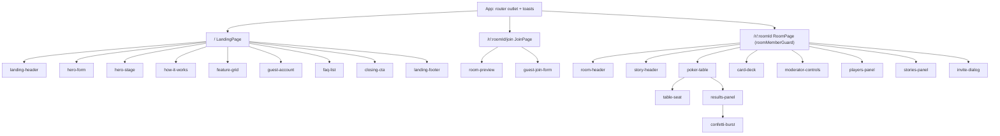

# Component tree

```mermaid
flowchart TB
  app[App: router outlet + toasts]
  app --> landing["/ LandingPage"]
  app --> join["/r/:roomId/join JoinPage"]
  app --> room["/r/:roomId RoomPage (roomMemberGuard)"]

  landing --> lh[landing-header] & hf[hero-form] & hs[hero-stage] & hiw[how-it-works]
  landing --> fg[feature-grid] & ga[guest-account] & faq[faq-list] & cta[closing-cta] & lf[landing-footer]

  join --> rp[room-preview] & gjf[guest-join-form]

  room --> rh[room-header] & sh[story-header] & pt[poker-table] & cd[card-deck]
  room --> mc[moderator-controls] & pp[players-panel] & sp[stories-panel] & id[invite-dialog]
  pt --> ts[table-seat] & res[results-panel]
  res --> cb[confetti-burst]
```

Shared building blocks: `logo`, `icon`, `avatar`, `toast`, and the style directives
`appDelay`, `appWidthPercent` and `appBackground` (templates never bind styles directly).
