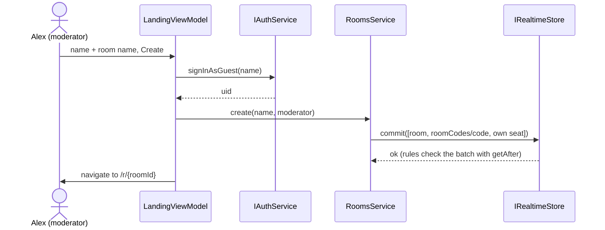
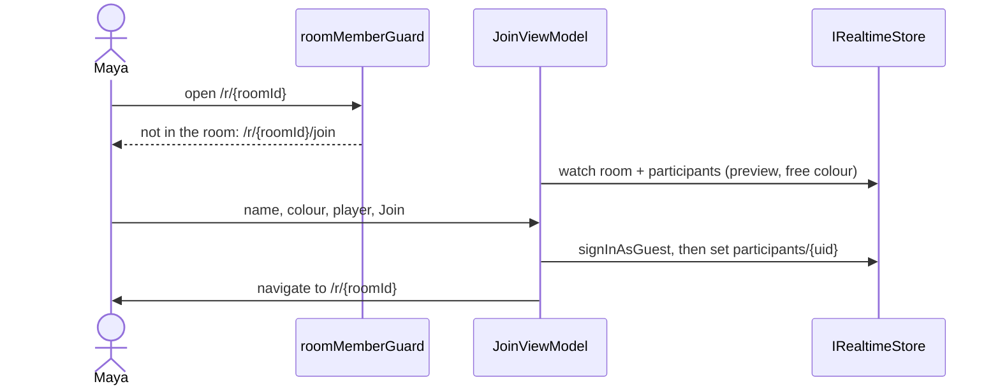
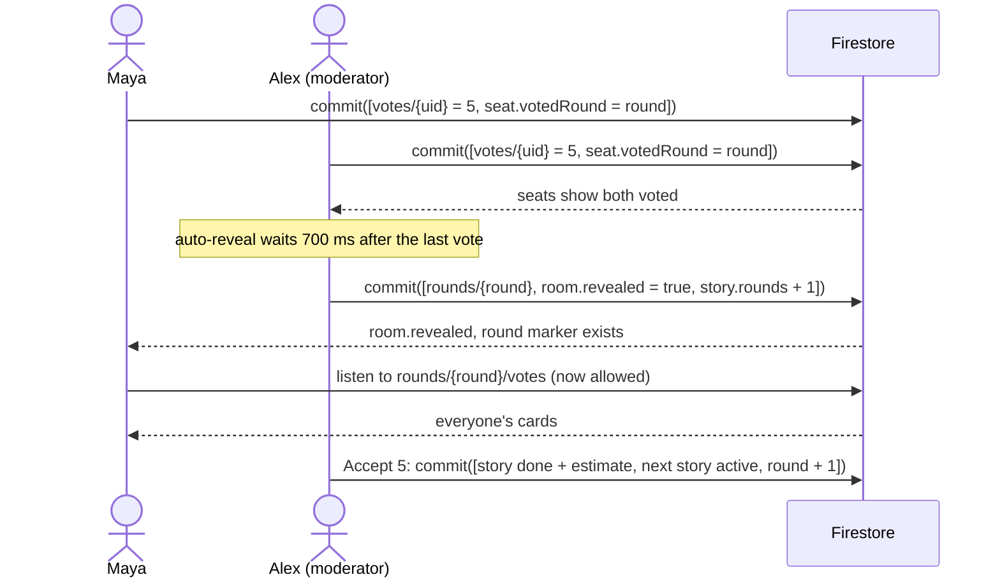
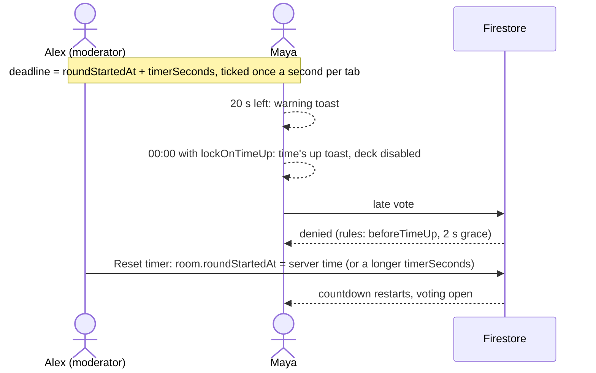

# Sequence diagrams

## Create a room

```mermaid
sequenceDiagram
  actor Alex as Alex (moderator)
  participant VM as LandingViewModel
  participant Auth as IAuthService
  participant Rooms as RoomsService
  participant Store as IRealtimeStore
  Alex->>VM: name + room name, Create
  VM->>Auth: signInAsGuest(name)
  Auth-->>VM: uid
  VM->>Rooms: create(name, moderator)
  Rooms->>Store: commit([room, roomCodes/code, own seat])
  Store-->>Rooms: ok (rules check the batch with getAfter)
  VM->>Alex: navigate to /r/{roomId}
```

## Join by link

```mermaid
sequenceDiagram
  actor Maya
  participant Guard as roomMemberGuard
  participant VM as JoinViewModel
  participant Store as IRealtimeStore
  Maya->>Guard: open /r/{roomId}
  Guard-->>Maya: not in the room: /r/{roomId}/join
  VM->>Store: watch room + participants (preview, free colour)
  Maya->>VM: name, colour, player, Join
  VM->>Store: signInAsGuest, then set participants/{uid}
  VM->>Maya: navigate to /r/{roomId}
```

## Vote, flip and settle

```mermaid
sequenceDiagram
  actor Maya
  actor Alex as Alex (moderator)
  participant Store as Firestore
  Maya->>Store: commit([votes/{uid} = 5, seat.votedRound = round])
  Alex->>Store: commit([votes/{uid} = 5, seat.votedRound = round])
  Store-->>Alex: seats show both voted
  Note over Alex: auto-reveal waits 700 ms after the last vote
  Alex->>Store: commit([rounds/{round}, room.revealed = true, story.rounds + 1])
  Store-->>Maya: room.revealed, round marker exists
  Maya->>Store: listen to rounds/{round}/votes (now allowed)
  Store-->>Maya: everyone's cards
  Alex->>Store: Accept 5: commit([story done + estimate, next story active, round + 1])
```

## Countdown and time up

```mermaid
sequenceDiagram
  actor Alex as Alex (moderator)
  actor Maya
  participant Store as Firestore
  Note over Alex,Maya: deadline = roundStartedAt + timerSeconds, ticked once a second per tab
  Maya-->>Maya: 20 s left: warning toast
  Maya-->>Maya: 00:00 with lockOnTimeUp: time's up toast, deck disabled
  Maya->>Store: late vote
  Store-->>Maya: denied (rules: beforeTimeUp, 2 s grace)
  Alex->>Store: Reset timer: room.roundStartedAt = server time (or a longer timerSeconds)
  Store-->>Maya: countdown restarts, voting open
```
